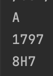

## Base Converter: write a program that converts an input decimal into any base (2<base<36) provided as input.  
```.py
def base_converter(decimal,base):
    answer = ""
    while decimal >= base:
        if decimal % base > 9:
            answer += chr((decimal % base - 10) + 65)
        else:
            answer += str(decimal % base)
        decimal = decimal // base
    if decimal % base > 9:
        answer += chr((decimal % base - 10) + 65)
    else:
        answer += str(decimal % base)
    return answer[::-1]

print(base_converter(10,16))
print(base_converter(10987,20))
print(base_converter(10987,36))
```

