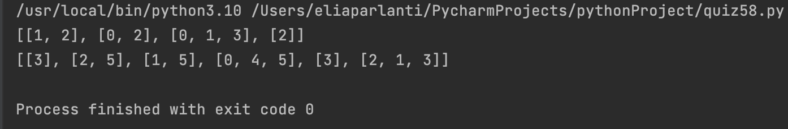

## Router’s route: given a list of a, b values, where a is the source node and b is the target node in a network with n nodes, where a and b < n, find the list of neighbours for all the nodes. 
```.py
def guide(node : int, points : list):
    answer = []
    # i is 1-4
    for i in range(node):
        answer.append([])

    for i in range(node):
        # x is 1-4
        for x in range(len(points)):
            # by doing answer[i] then appending it, you are appending the numbers into each list inside the answer list
            # since its x in points, you don't need to use points again. Just use x
            origin = points[x][0]
            destination = points[x][1]
            if origin == i:
                answer[i].append(destination)
            if destination == i:
                answer[i].append(origin)

    return answer

output = guide(4,[(0,1),(0,2),(1,2),(2,3)])
print(guide(node=4, points=[(0,1),(0,2),(1,2),(2,3)]))
output2 = guide(6, [(0,3),(2,1),(2,5),(4,3),(5,1),(3,5)] )
print(guide(6, [(0,3),(2,1),(2,5),(4,3),(5,1),(3,5)]))
```

