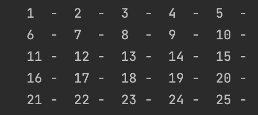

## Time Trial: Create a program that produces the grid below

```.py
def TimeTrial():
    counter = 1
    for row in range(5):
        for col in range(5):
            print(str(counter).center(5),end="-")
            counter += 1
        print("")

print(TimeTrial())
```

