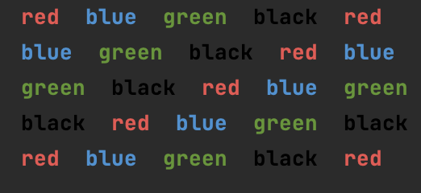

## I don't have access to the slides so I can't write down the problem

```.py
current = 0
colors = ["red","blue","green","black"]
colore=["\033[1;31m","\033[1;34m","\033[1;32m","\033[1;30m"]
for rows in range(5):
    for column in range(5):
        if current > 3:
            current = 0
        print(f"{colore[current]} {colors[current]}".center(5), end=" ")
        current += 1
    print("")
```

