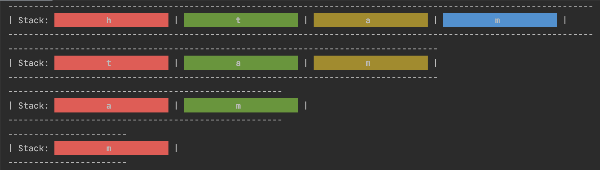

## Time Trial: Given a string, create a program that produces the sum of the characters in the string. Use a stack. 

```.py
from Unit5.stack import stack

class adder:
    def __init__(self,stack_txt):
        self.stack_txt=stack_txt
    def sum(self):
        answer = 0
        while self.stack_txt.empty() == False:
            letter = self.stack_txt.pop()
            answer += (ord(letter) - 96)
            print(self.stack_txt)
        return answer

    def get(self):
        return self.stack_txt


text_st = stack()
for l in "math":
    text_st.push(l)


outpput1 = adder(stack_txt=text_st)
print(outpput1.get())
print(outpput1.sum())
```

