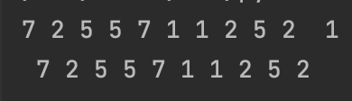
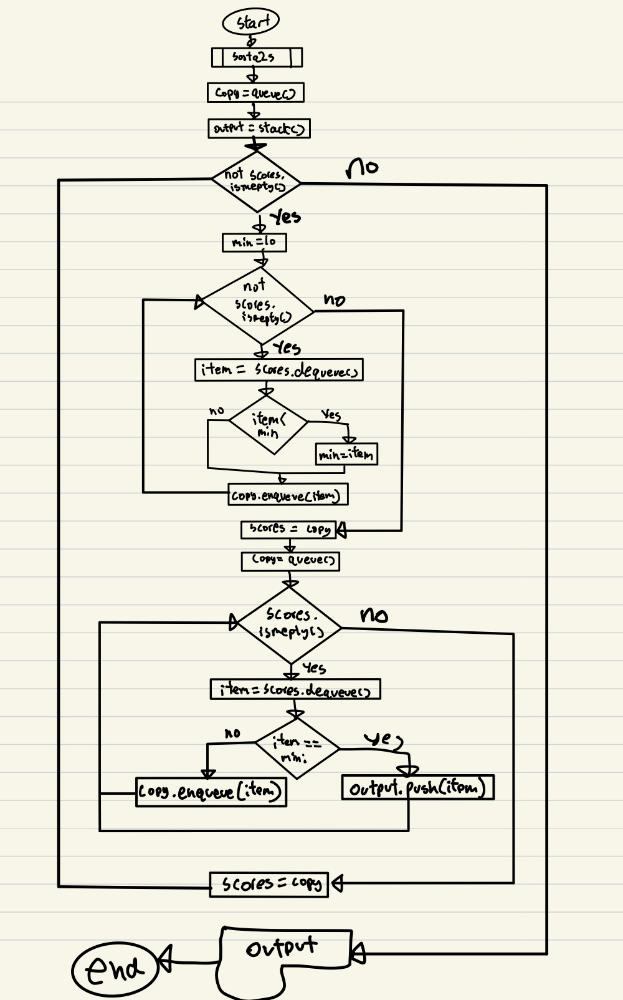

```.py
import random
from Unit5.queue import queue
from Unit5.stack import stack

def sortq2s(scores:queue)->stack:
    copy=queue()
    output = stack()
    min = 10
    # finding the maximum
      while not scores.ismepty(): # Looping if the queu is not empty
        item = scores.dequeue()
        if item<min:
            min=item
        copy.enqueue(item)
    print(copy, scores,min)
    scores = copy
    copy = queue() # Empty queue
    # Remove the min from original queue
    while scores.ismepty():
        item = scores.dequeue()
        if item == min:
            output.push(item)
        else:
            copy.enqueue(item)
    print(copy,scores)

scores=queue()
for i in range(10):
    scores.enqueue(random.randint(1,8))

sortq2s(scores)
```


