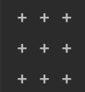
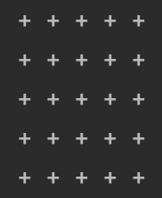
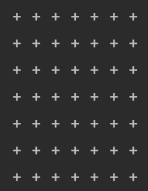

## Create a program that receives an integer and a character and prints a square with the character.

```.py
def square(n):
    for row in range(n):
        for column in range(n):
            print("+", end=" ") # To sepereate each '+'
        print(" ") # To skip to the next ime
test1 = square(3)
test2 = square(5)
test3 = square(7)
print(test1)
print(test2)
print(test3)

```



