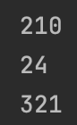

## Create a program that concatenates the results of A-B and A+B
```.py
def quiz67(a,b):
    answer = f"{a-b}{a+b}"
    return answer
test1 = quiz67(6,4)
test2 = quiz67(3,1)
test3 = quiz67(12,9)
print(test1)
print(test2)
print(test3)
```

