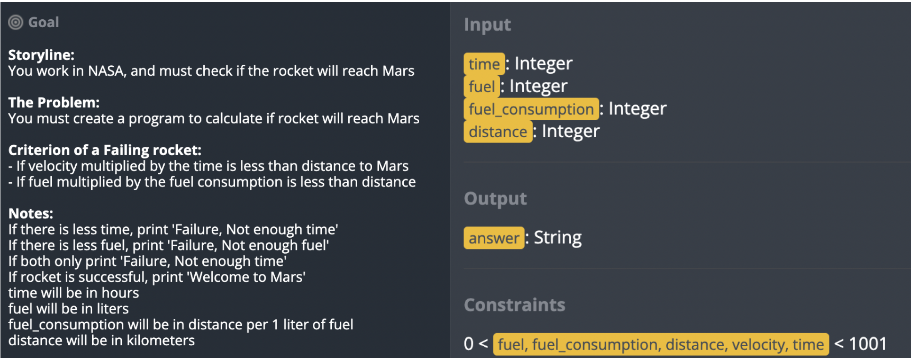
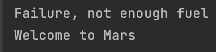

## Solve the following COC using Boolean Equations.

```.py
def quiz68(distance, time, velocity, fuel, fuel_consumption):
    velotime = velocity+time
    fuelcons = fuel*fuel_consumption
    A = distance > velotime
    B = distance < fuelcons
    output = "Welcome to Mars" # This is what will be returned if none of the conditions are met
    if A and (not B):
        output = "Failure, not enough time"
    if B and (not A):
        output = "Failure, not enough fuel"
    if A and B:
        output = "Failure, not enough time"
    return output

test1 = quiz68(100, 100, 10, 100, 100)
print(test1)
test2 = quiz68(50,70,100,10,2)
print(test2)
```

