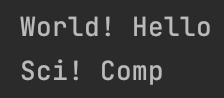

## Write a program that produces the following input/output

```.py
def quiz69(words: str):
    split_words = words.split(" ") # To seperate the words
    return f"{split_words[1]} {split_words[0]}" # Change the order of the words

test1 = quiz69("Hello World!")
test2 = quiz69("Comp Sci!")
print(test1)
print(test2)
```

