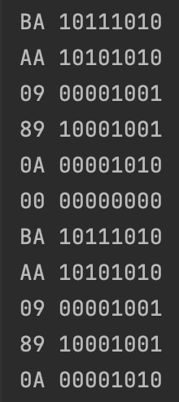
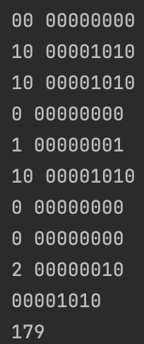

## TCP/IP Packet: write a program in OOP that forms a IP Packet given the IPs, ports, MAC addresses and data 

```.py
class ippacket:
    # TX is the sender and RX is the reciever
    def __init__(self, port_tx:int, port_rx:int, mac_rx:str, mac_tx:str, ip_rx:str, ip_tx:str):
        self.port_tx = self.binirizer(port_tx)
        self.port_rx= self.binirizer(port_rx)
        self.mac_rx= self.maclist2binary(mac_rx.split(":"))
        self.mac_tx= self.maclist2binary(mac_tx.split(":"))
        self.ip_rx= self.iplist2binary(ip_rx.split("."))
        self.ip_tx= self.iplist2binary(ip_tx.split("."))

    def binirizer(self, number:int)->str:
        result = ""
        while number >0:
            result +=str(number%2)
            number = number // 2
        return result[::-1].rjust(8, "0")

    def hex2dex(self, num:str)->int:
        symbols = {'A':10,'B':11, 'C': 12, 'D': 13, 'E': 14, 'F': 15}
        result=0
        "increasing the index by 1 every time"
        for index, digit in enumerate(num):
            if digit in "0123456789":
                digit_dec = int(digit)
            else:
                digit_dec = symbols[digit]
            result += 16**(len(num)-1-index)*digit_dec
        return result

    def maclist2binary(self, mac):
        "mac = ['A0','BB', ...]"
        result = ""
        for element in mac:
            binary = self.binirizer(self.hex2dex(element))
            result += binary
            print(element, binary)
        return result

    def iplist2binary(self, ip):
        result = ""
        for element in ip:
            binary = self.binirizer(int(element))
            result += binary
            print(element, binary)
        return result

    def build(self):
        return self.ip_tx + self.mac_tx + self.port_tx + self.ip_rx + self.mac_rx + self.port_rx

test1 = ippacket(ip_rx="10.10.0.1", ip_tx="10.0.0.2",
                 mac_rx="BA:AA:09:89:0A:00", mac_tx="BA:AA:09:89:0A:00", port_rx=80, port_tx=80)
print(test1.binirizer(number=10))
print(test1.hex2dex(num="B3"))
print(test1.mac_rx)
print(test1.build())
```


