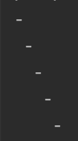
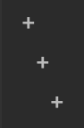
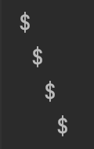

## Reverse mode
```.py
class quiz65:
    def __init__(self):
        return
    def calc(self,n,water):
        for i in range(n): # Loop for every row there is
            answer = i * " " + water
            print(answer)

print(quiz65().calc(5,"-"))
print(quiz65().calc(3,"+"))
print(quiz65().calc(4,"$"))
```



